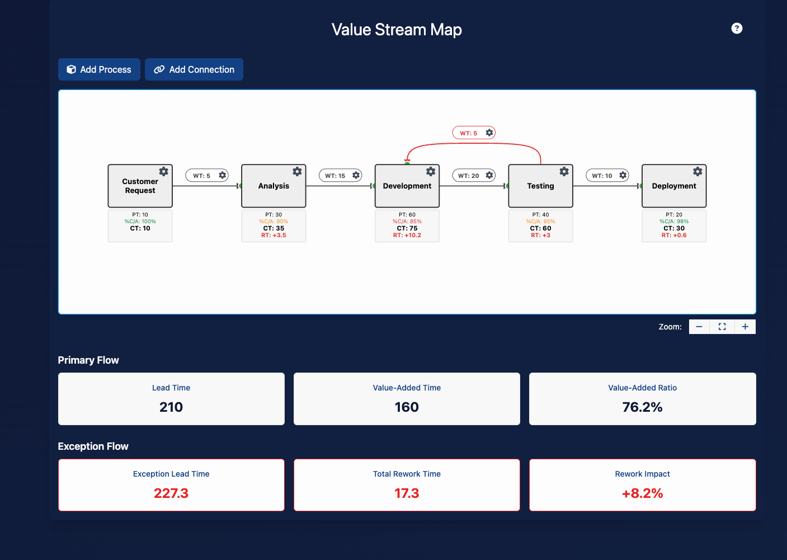

# Value Stream Map

An interactive Value Stream Mapping (VSM) tool built with SvelteKit and D3.js. This application allows you to create, visualize, and analyze value streams with support for process blocks, connections, and comprehensive metrics including rework cycles.



## Features

- **Interactive Diagram Editor**:
  - Create, position, and connect process blocks
  - Drag-and-drop interface for easy layout adjustments
  - Edit process and connection properties
  - Add rework/feedback loops with visual distinction

- **Comprehensive Metrics**:
  - Process times and wait times
  - Complete & Accurate (C/A) percentages for quality tracking
  - Rework calculations and impact analysis
  - Best-case and worst-case scenario measurements
  - Value-added ratio calculations

- **Modern UI**:
  - Responsive design with Tailwind CSS
  - Modals for editing and configuration
  - Zoom and fit controls for the diagram
  - Comprehensive metrics guide with tooltips

## Getting Started

### Prerequisites

- Node.js (v18 or newer)
- npm (v8 or newer)

### Installation

1. Clone the repository:

   ```bash
   git clone git@github.com:bdfinst/value-stream-map.git
   cd value-stream-map
   ```

2. Install dependencies:

   ```bash
   npm ci
   ```

### Development

Start the development server:

```bash
npm run dev
```

The application will be available at [http://localhost:5173](http://localhost:5173) (or another port if 5173 is in use).

To open the application automatically in your default browser:

```bash
npm run dev -- --open
```

### Testing

Run all tests (unit and e2e):

```bash
npm test
```

Run only unit tests:

```bash
npm run test:unit
```

Run end-to-end tests:

```bash
npm run test:e2e
```

Run unit tests in watch mode:

```bash
npm run test:unit -- --watch
```

### Linting and Formatting

Lint the codebase:

```bash
npm run lint
```

Format the code:

```bash
npm run format
```

### Building for Production

Build the application for production:

```bash
npm run build
```

Preview the production build:

```bash
npm run preview
```

## Using the Application

1. **Create Process Blocks**:
   - Click "Add Process" to create a new process
   - Configure the process name, processing time, and C/A percentage
   - Drag to position the process on the canvas

2. **Create Connections**:
   - Click "Add Connection" to create a new connection
   - Select source and target processes
   - Set wait time between processes

3. **Create Rework Loops**:
   - Add a connection from a downstream process to an earlier process
   - The connection will automatically format as a rework connection

4. **View Metrics**:
   - See process-level metrics on each process block
   - View VSM-level metrics in the metrics panel
   - Toggle between best-case and worst-case scenarios

5. **Help & Documentation**:
   - Click the help icon in the header for a comprehensive metrics guide

## License

This project is licensed under the MIT License - see the LICENSE file for details.

## Acknowledgments

- Inspired by Lean and Value Stream Mapping methodologies
- Built with modern web technologies for interactive visualization
